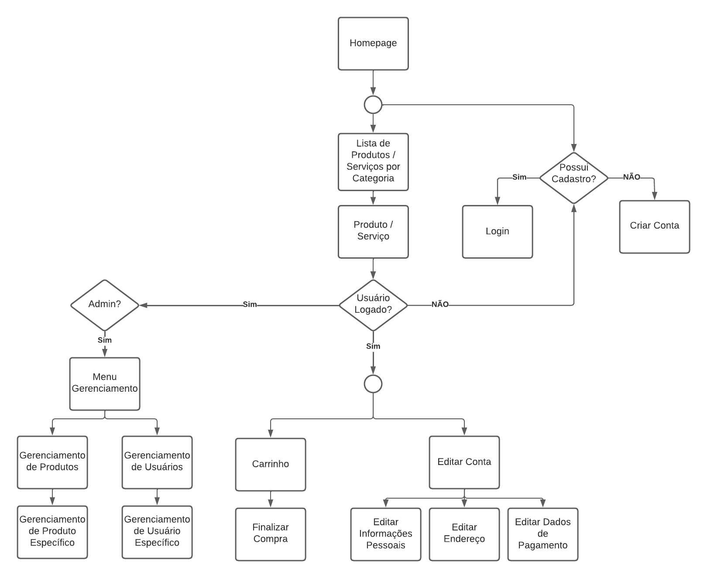

# Web Projects - AZULÃO PETSHOP

<p align="justify">
    Project for the Web Development Introduction course - SCC0219.<br>
    The group decided that the website to be developed would be a virtual pet shop.
</p><br>

## Authors:
- Felipe Cadavez Oliveira - 11208558

- Gustavo Lelli Guirao - 11918182

- Luiz Fernando Rabelo - 11796893
<br><br><br>

## 1. Requirements

<p align="justify">
    The system should have 2 types of users: clients and administrators.<br>
    Administrators are responsible for registering/managing clients, products, and provided services. The application comes with an "admin" account with the password "admin".<br>
    Clients are users who access the system to buy products and/or services.<br>
    The registration for each client includes name, CPF, gender, phone, and email.<br>
    Product records include name, ID, photo, description, price, and stock quantity.<br>
    Service records include name, ID, photo, description, price, schedule, and operating hours.<br>
    Product Sales: Products and services are selected, added to a cart, and their quantity chosen. Products are purchased using a credit card number (any number is accepted by the system). The quantity of sold products is subtracted from the stock quantity. Carts are emptied only when payment is made or when customers remove all products.<br>
    Product Management: Administrators can create/update/read/delete new products. For example, they can change the stock quantity.<br>
    Service Management: Services act like products with the difference that the "stock quantity" of a service is actually the number of times that service can be requested in a day. This quantity can be changed, but it will be reset to the initial daily quantity every time a day passes. The service also has an extra field for operating hours, preventing a service from being requested outside the store's operating hours.
    The system is responsive and aims for good accessibility and usability for its users.
</p><br><br>

## 2. Project Description

<p align="justify">
    Our website is a virtual pet shop that sells all kinds of products for pet care, including hygiene, leisure, food, and other needs. In addition to products, services will also be offered, such as baths, grooming, veterinary consultations, etc.
</p>

### Navegation Diagrams:



<br><br>

The images of the *mockup* are in the folder ```/mockups.``` They can also be accessed through the links below:

- [Homepage](https://raw.githubusercontent.com/gustavo-lelli/SCC0219-Online-Pet-Shop/main/mockups/Home.png)

- [List of Products by Category](https://raw.githubusercontent.com/gustavo-lelli/SCC0219-Online-Pet-Shop/main/mockups/ListaPorCategoria.png)

- [Product](https://raw.githubusercontent.com/gustavo-lelli/SCC0219-Online-Pet-Shop/main/mockups/Produto.png)

- [Service](https://raw.githubusercontent.com/gustavo-lelli/SCC0219-Online-Pet-Shop/main/mockups/Servico.png)

- [Login](https://raw.githubusercontent.com/gustavo-lelli/SCC0219-Online-Pet-Shop/main/mockups/Login.png)

- [Create Account](https://raw.githubusercontent.com/gustavo-lelli/SCC0219-Online-Pet-Shop/main/mockups/CriarConta.png)

- [Cart](https://raw.githubusercontent.com/gustavo-lelli/SCC0219-Online-Pet-Shop/main/mockups/Carrinho.png)

- [Complete Purchase](https://raw.githubusercontent.com/gustavo-lelli/SCC0219-Online-Pet-Shop/main/mockups/FinalizarCompra.png)

- [Personal Information Editing (Admin)](https://raw.githubusercontent.com/gustavo-lelli/SCC0219-Online-Pet-Shop/main/mockups/EditarInfoPessoaisAdmin.png)

- [Personal Information Editing (Client)](https://raw.githubusercontent.com/gustavo-lelli/SCC0219-Online-Pet-Shop/main/mockups/EditarInfoPessoaisCliente.png)

- [Address Editing (Client)](https://raw.githubusercontent.com/gustavo-lelli/SCC0219-Online-Pet-Shop/main/mockups/EditarEnderecoCliente.png)

- [Payment Editing (Client)](https://raw.githubusercontent.com/gustavo-lelli/SCC0219-Online-Pet-Shop/main/mockups/EditarPagamentoCliente.png)

- [Product Management](https://raw.githubusercontent.com/gustavo-lelli/SCC0219-Online-Pet-Shop/main/mockups/GerenciarProdutos.png)

- [User Management](https://raw.githubusercontent.com/gustavo-lelli/SCC0219-Online-Pet-Shop/main/mockups/GerenciarUsuarios.png)

- [Specific Product Management](https://raw.githubusercontent.com/gustavo-lelli/SCC0219-Online-Pet-Shop/main/mockups/GerenciarProduto.png)

- [Specific User Management](https://raw.githubusercontent.com/gustavo-lelli/SCC0219-Online-Pet-Shop/main/mockups/GerenciarUsuario.png)

<br><br>

### Functionalities

The functionalities aimed by our site are:
- Login with email and password, with the option to create a new account or reset the password.
- Viewing client information, with the option to change personal information, payment details, or address.
- Viewing the admin page, with the option to manage the store's products and users.
- Inserting services by the admin, with schedule, operating hours, and service description.
- Access to the homepage, with a display of selected products by the store.
- Viewing a product, with its name, description, price, and button to add to cart.
- Viewing a service, with its name, description, price, scheduling, and option to pick up the pet at home or bring it to the pet shop (note that this function is only available for São Carlos ZIP codes).
- Commenting and reviewing a product/service.
- Access to the shopping cart, with the option to change item quantities, check the total price with shipping, and complete the purchase.
- Option to enter credit card information for quicker payment.
- Option to change the delivery address.
<br><br>

### Informations Stored in Server

**Accounts:**

- Email
- Password
- Name
- CPF
- Gender
- Is_Admin?
<br><br>

**Addresses:**

- Associated account
- ZIP Code
- Number
- Complement
<br><br>

**Saved Cards:**

- Cardholder's CPF
- Card number
- Cardholder's name
<br><br>

**Products:**

- Name
- Description
- Price
- ID
- Photo
- Stock quantity
<br><br>

**Services:**

- Name
- ID
- Photo
- Schedule
- Operating hours
<br><br>

## 3. Comments of the Code
<p align="justify">
    The code doesn't have responsiveness yet, only the site's structure and styling are compatible with traditional desktops.
    Since the code was developed in Vue, we didn't face significant difficulties apart from learning how to use it and using localStorage. However, once these concepts were understood, writing the code was mostly laborious due to the large number of scripts that needed to be created.
</p><br>

## 4. Test Plan
<p align="justify">
    The testing plan consists of testing the site as it's being developed, using browsers like Google Chrome, Firefox, and Brave.
</p><br>

## 5. Test Results
<p align="justify">
    It shows satisfactory results, not yet displaying responsiveness (as it hasn't been implemented yet), but there's integration among all tabs so that both the client and the administrator don't encounter "empty" pages.
</p><br>

## 6. Building

### Front

```
cd site
```

#### Installing Dependencies:

```
npm install
```

#### Compiling in Development Mode:

```
npm run serve
```

#### Compiling and Minifying for Production:

```
npm run build
```

### Back

```
cd server
```

#### Installing Dependencies:

```
npm install
```

#### Server Initialization

```
npm start
```

## 7. Problems
<p align="justify">
    The major problems were learning the Vue structure and managing local storage (storing accounts, product data, etc.), in addition to the time required to enter the details of each product.
</p><br>

## 8. Comments
<p align="justify">
    Application security was completely neglected for educational purposes. For production purposes, look for more secure alternatives.<br>
    The tool used for mockup development was Figma.
    For scripting development, such as HTML, CSS, JavaScript, we used the VueJS framework.
</p>
